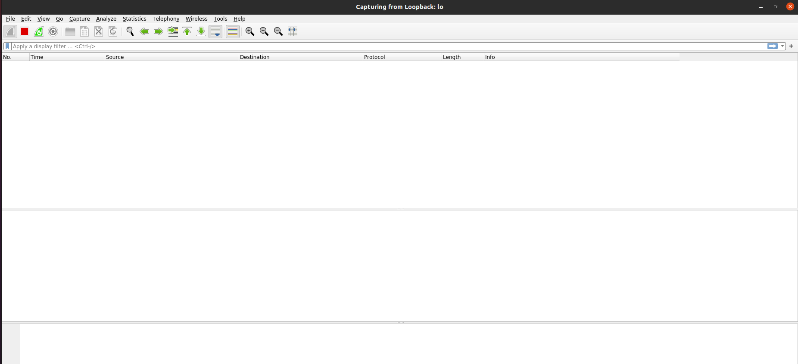

# CSCE-4050-5050_Group-3

## Description
A REST server with one endpoint, “/weather”, that returns a static, hardcoded JSON reply.

## Repository Structure
```text
csce-4050-5050_group-3/
├─Screenshots/
├─client.py
├─README.md
├─requirements.txt
└─server.py
```

## Requirements
```text
- Ubuntu20.04 (SEED Virtual Machine)
- Python3 & pip
- Dependencies ()
```

## Task 1: Setting Up REST Server/Client.

### Wireshark interface before running the server and client program


### Running the server

```bash
$ python3 server.py
```

### Terminal output of the server running


### Running the client

```bash
$ python3 client.py
```

### Terminal output of the client getting data from the server


### Wireshark captured the requests and responses


### HTTP Stream showing the data that the client got from the server


## Task 2: Confidentiality and Data Integrity in the Symmetric Setting

After implementing encryption and decryption logics to the project to provide Confidentiality, we used Wireshark to capture the communication between the client and the server.

### Screenshot showing the server running


### Screenshot showing the client getting the data in plaintext


### Wireshark captured client-server communication


### HTTP Stream showing the encrypted data that the client received


## Note

The repository will be updated as the project progresses.